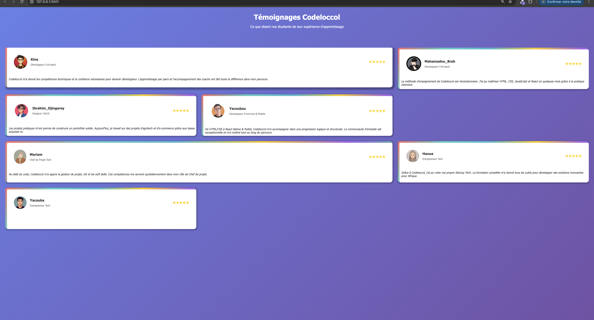
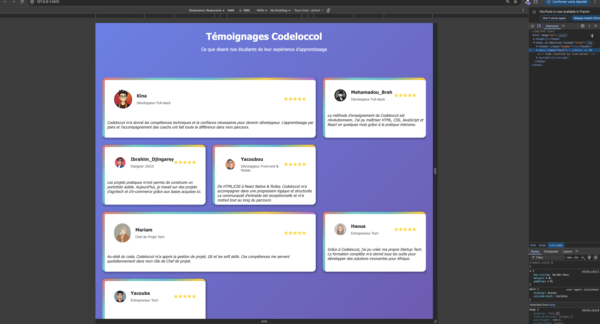
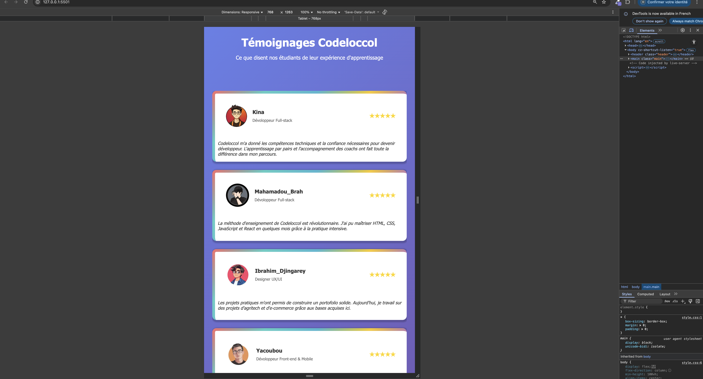
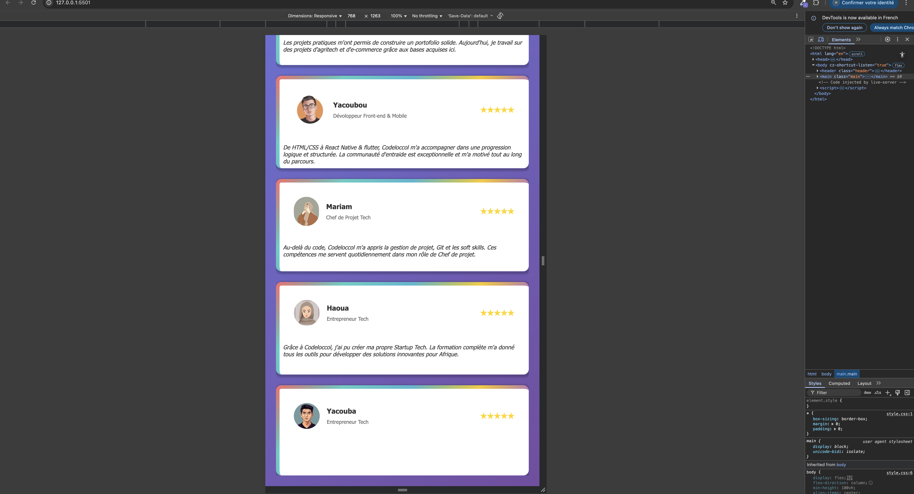
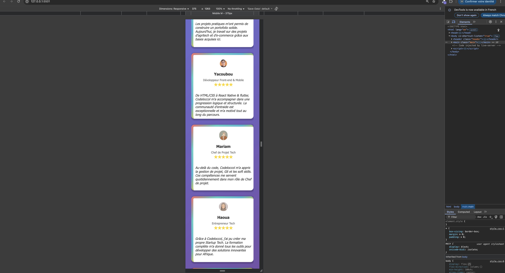
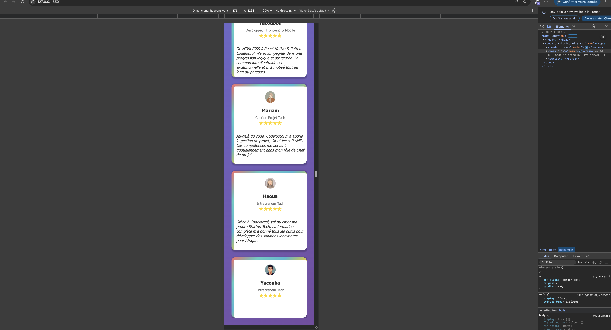

## Exercice6: Testimonial Page

## Description

Ce projet consiste à créer une page web affichant une grille de témoignages d'étudiants de Codeloccol. L'objectif est de mettre en pratique les compétences en HTML et CSS pour structurer, styliser et rendre responsive une interface utilisateur moderne. Ce projet permet également de renforcer la maîtrise des bases du développement web, tout en valorisant les retours d'expérience des apprenants.

## Objectifs

- Maîtriser la structure HTML et l'utilisation du CSS pour la mise en page.

- Travailler avec des images et les intégrer efficacement.

- Créer une interface responsive pour une lecture optimale sur tous les écrans.

- Comprendre l'importance des témoignages dans une interface et développer une attention particulière aux détails.

## Spécifications

- Structure HTML sémantique et respect des normes de design.

- Utilisation de CSS Grid pour créer une grille responsive.

- Ajout d'effets d'animation (hover) avec box-shadow et gestion des transitions.

- Documentation et bonnes pratiques suivies (source : CSS Tricks - Complete Guide Grid).

## Codes & Balises Sémantiques

Le projet utilise les balises HTML/CSS sémantiques pour améliorer l'accessibilité et la structuration du contenu :

(header) : pour l'entête de la page.
(section) : pour chaque témoignage.
(footer) : pour les informations de bas de page.

grid-template-columns et grid-template-rows : Crée une grille avec un nombre de colonnes et de lignes spécifiés.

background : Applique un dégradé linéaire avec des couleurs et un angle définis.

border-top : Ajoute une bordure transparente en haut de l'élément.

box-shadow : Crée une ombre portée sous l'élément, ajoutant de la profondeur.

transition : Applique une transition fluide lors de changements dans certaines propriétés CSS.

transform : Permet de déplacer l'élément sur l'axe Y (haut ou bas).

## Capture d'ecran

## lien Github_Page

[Demonstration]()

## Expérience Personnelle

Mon expérience avec ce projet a été plutôt fluide, à l'exception de l'apprentissage et de la mise en œuvre du CSS Grid, qui m'a demandé un peu de temps pour comprendre comment bien organiser les éléments. De même, l'application des couleurs en dégradé et des animations avec box-shadow m'a permis de mieux comprendre les effets visuels dans une interface web. Ces concepts m'ont pris un peu de temps, mais une fois compris, ils ont grandement amélioré la présentation de la page.
